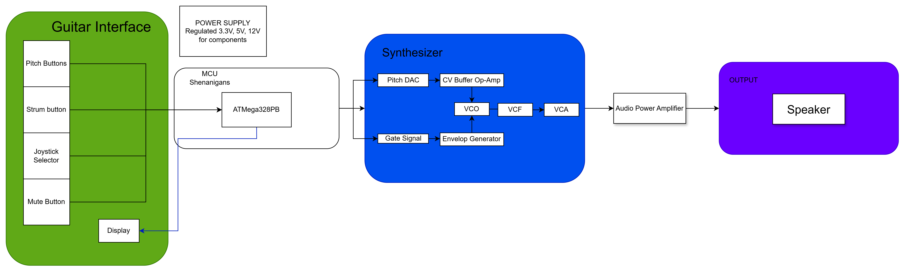

# Final Project

**Team Number: 03**

**Team Name: Synth Specialists**

| Team Member Name  | Email Address           |
| ----------------- | ----------------------- |
| Adam Shalabi      | adamshal@seas.upenn.edu |
| Brandon Parkansky | bpar@seas.upenn.edu     |
| Panos Dimtsoudis  | panosdim@seas.upenn.edu |

**GitHub Repository URL:  https://github.com/upenn-embedded/final-project-s26-t03.git**

**GitHub Pages Website URL:** [for final submission]*

## Final Project Proposal

### 1. Abstract

Our project repurposes an old toy guitar controller into an embedded music-learning device. The controller’s buttons will be programmable and mapped to individual notes or chords, while the strum bar will trigger sound generation. The sound will be produced by a synthesizer that we will design and build, and features like a mute button, whammy stick, and small display will make the device more expressive and customizable.

### 2. Motivation

Our motivation for choosing this project is that it combines hardware reuse with a meaningful educational application. Rather than leaving an obsolete gaming peripheral unused, we saw an opportunity to redesign it into a low-cost and engaging platform for teaching fundamental music concepts such as notes, chords, and pitch variation. The main problem we are trying to solve is that beginner music tools are often either too limited, too expensive, or not very interactive. By reusing an existing guitar controller and pairing it with a custom-built synthesizer, we can create a more hands-on and accessible way for users to learn basic musical ideas. This project is interesting because it combines embedded systems, digital sound generation, and interface design, while also showing how outdated electronics can be transformed into practical and creative learning tools.

### 3. System Block Diagram

### 4. Design Sketches

### 5. Software Requirements Specification (SRS)

**5.1 Definitions, Abbreviations**

 **MCU** : ATmega328PB microcontroller

 **DAC** : Digital-to-Analog Converter

 **VCO** : Voltage-Controlled Oscillator

 **VCF** : Voltage-Controlled Filter

 **VCA** : Voltage-Controlled Amplifier

 **CV** : Control Voltage

 **UI** : User Interface

**5.2 Functionality**

| ID     | Description                                                                                                                                                                                                                                 |
| ------ | ------------------------------------------------------------------------------------------------------------------------------------------------------------------------------------------------------------------------------------------- |
| SRS-01 | The system shall read the guitar pitch buttons and determine the selected note or chord when a button is pressed.                                                                                                                           |
| SRS-02 | When the user actuates the strum bar, the MCU shall generate and output the correspondingpitch control signal and gate signal.                                                                                                              |
| SRS-03 | The system shall read the whammy input through the ADC and update pitch bend during active note playback.                                                                                                                                   |
| SRS-04 | The system shall support a mute function that disables note output when the mute button being pressed.                                                                                                                                     |
| SRS-05 | The firmware shall continuously monitor all required inputs during operation, including pitch buttons, strum bar, mute button, joystick, and whammy control, without causing the system to miss valid note-trigger events during normal use |
| SRS-06 | The display and joystick-based UI shall allow the user to change at least one synth setting (such as waveform, octave, or mode), and the selected setting shall be updated on the display.                                                 |

### 6. Hardware Requirements Specification (HRS)

**6.1 Definitions, Abbreviations**

 **SPI** : Serial Peripheral Interface

 **I2C** : Inter-Integrated Circuit

 **ADC** : Analog-to-Digital Converter

 **PWM** : Pulse-Width Modulation

**6.2 Functionality**

| ID     | Description                                                                                                                                                                                                    |
| ------ | -------------------------------------------------------------------------------------------------------------------------------------------------------------------------------------------------------------- |
| HRS-01 | The system shall use an ATmega328PB-based control system to interface with all required user inputs, including the pitch buttons, strum input, mute button, joystick, and whammy control                      |
| HRS-02 | The system shall include a ADC-based pitch CV generation stage capable of producing a stable control signal for the synthesizer voice                                                                           |
| HRS-03 | The system shall include an audio output stage consisting of a buffer and power amplifier capable of driving a speaker or external audio output                                                               |
| HRS-04 | The system shall include a display module for showing menu or mode information and shall communicate with the MCU using a supported serial protocol such as  I2C .                                             |

### 7. Bill of Materials (BOM)

https://docs.google.com/spreadsheets/d/1yVx339OijMxmClf8FyQ_4eZAxMqQx_l-zpqn3cilw3A/edit?usp=sharing

### 8. Final Demo Goals

We will first demonstrate the functionality of the joystick selector and display by setting the buttons to specific chords. We will then play a song and showcase our synthesizer pitch bending with the whammy stick.

### 9. Sprint Planning

| Milestone  | Functionality Achieved           | Distribution of Work                    |
| ---------- | -------------------------------- | --------------------------------------- |
| Sprint #1  | Get Guitar and MCU communicating | We'll figure it out - but work together |
| Sprint #2  | Complete MCU Code (Synth)        | ~~                                      |
| MVP Demo   | Make Synth and Speaker work      | ~~                                      |
| Final Demo | Add Display and Whammy Stick     | ~~                                      |

**This is the end of the Project Proposal section. The remaining sections will be filled out based on the milestone schedule.**

## Sprint Review #1

### Last week's progress

We took apart the original guitar and tested each interface button, stick and switch with a multimeter to make sure current flowed through them and they were functional. We decided to pivot from an analog synthesizer to a digital synthesizer that operates off of code, and created the first draft of this code for our intial test. We also noticed that the main board which we'd be replacing in the guitar did not fit properly with the internals, so we created a CAD model of the board to laser cut a new one with more leeway in the measurements for the openings to make it slot in seamlessly.

### Current state of project

We're still waiting on the remainder of our parts to come in so we can assmeble the system, flash the code and run our intial tests, but for now we've decided to pivot our strategy from connecting only through jumper wires to instead running connections through copper tape on our new iteration of the internal board, as per our team manager's suggestion.

### Next week's plan

Build the first full working version of the guitar, test the existing code and mke changes as needed, then begin adding LCD screen functionality.

## Sprint Review #2

### Last week's progress

We built a breadboarded prototype of the system with the parts available in detkin since our ADC and a few other Adafruit parts still hadn't come in. We had to make a few code changes to account for the difference in functionality due to the lack of an ADC but eventually got decent sound output as desired, then wired up the LCD display though it still isn't functional and doesn't correspond to notes/inputs like we want it to.

### Current state of project

We have a working prototype and are considering using the same no-ADC method in our MVP to reduce complexity and get a full built working version as soon as possible.

### Next week's plan

Print the main master board and solder the system using the wiring format we've used in our prototype and fit it to the actual guitar, fix the LCD screen to at least show some response to inputs even if it isn't fully functional yet.

## MVP Demo

## Final Report

Don't forget to make the GitHub pages public website!
If you’ve never made a GitHub pages website before, you can follow this webpage (though, substitute your final project repository for the GitHub username one in the quickstart guide):  [https://docs.github.com/en/pages/quickstart](https://docs.github.com/en/pages/quickstart)

### 1. Video

### 2. Images

### 3. Results

#### 3.1 Software Requirements Specification (SRS) Results

| ID     | Description                                                                                               | Validation Outcome                                                                          |
| ------ | --------------------------------------------------------------------------------------------------------- | ------------------------------------------------------------------------------------------- |
| SRS-01 | The system shall read the guitar pitch buttons and determine the selected note or chord when a button is pressed. | CONFIRMED: As buttons pressed, code attributes key (as tested in serial monitor shown in MVP demo, and heard in sound output).                                                                                                                           
| SRS-02 | When the user actuates the strum bar, the MCU shall generate and output the corresponding pitch control signal and gate signal. | CONFIRMED: Note plays when strummed                                                                                                              
| SRS-03 | The system shall read the whammy input through the ADC and update pitch bend during active note playback. | CONFIRMED: ADC detects whammy adjustments, vibrato added through code at threshold.                                                                                                                                   
| SRS-04 | The system shall support a mute function that disables note output when the mute button being pressed. | CONFIRMED: Mute button pulls mute pin, PWM stops when pressed.                                                                                                                                    
| SRS-05 | The firmware shall continuously monitor all required inputs during operation, including pitch buttons, strum bar, mute button, joystick, and whammy control, without causing the system to miss valid note-trigger events during normal use. | CONFIRMED: Essential inputs trigger interrupt, there is no latency or missed events when playing device. 
| SRS-06 | The display and joystick-based UI shall allow the user to change at least one synth setting (such as waveform, octave, or mode), and the selected setting shall be updated on the display. | CONFIRMED: Joystick controls screen, user can change configuration of notes, selection shows onscreen.                                                 
/
#### 3.2 Hardware Requirements Specification (HRS) Results

| ID     | Description                                                                                                                        | Validation Outcome                                                                                                      |
| ------ | ---------------------------------------------------------------------------------------------------------------------------------- | ----------------------------------------------------------------------------------------------------------------------- |
| HRS-01 | The system shall use an ATmega328PB-based control system to interface with all required user inputs, including the pitch buttons, strum input, mute button, joystick, and whammy control | CONFIRMED: ATMega has all input and output pins (pitch, strum, mute, joystick, whammy).                      
| HRS-02 | The system shall include a ADC-based pitch CV generation stage capable of producing a stable control signal for the synthesizer voice.                                                                            |
| HRS-03 | The system shall include an audio output stage consisting of a buffer and power amplifier capable of driving a speaker or external audio output. | CONFIRMED: buffer and amp circuit drives the speaker.                                                               
| HRS-04 | The system shall include a display module for showing menu or mode information and shall communicate with the MCU using a supported serial protocol such as  I2C .| CONFIRMED: Screen working, communicates with ATMega through I2C                                            

### 4. Conclusion

## References
